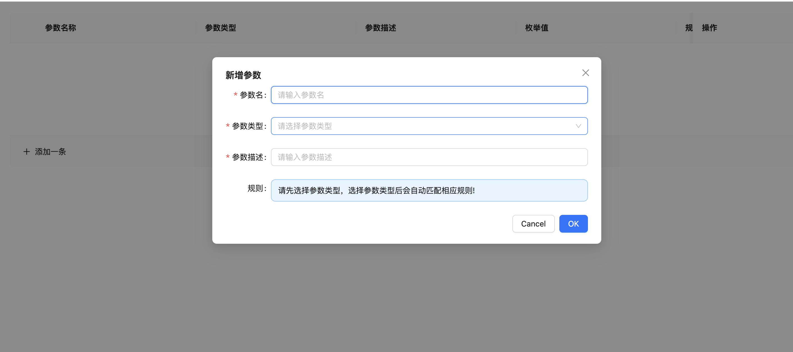

## json-schema-editor-visual

A json-schema editor of high efficient and easy-to-use, base on React.



## Usage
```
npm install ew-json-schema-editor-visual
```

```js
import schemaEditor from "ew-json-schema-editor-visual"
const [state,setState] = useState([])
const onChange = (value) => {
    console.log(value);
}
render(
    <SchemaEditor value={state} onChange={onChange} />,
  document.getElementById('root')
)
```

## Option Object


## SchemaEditor Props

| name | type | default | desc
| ---- | ----------- | --------- | --------- |
| `value` | string | null | the data of editor
| `onChange`| function | null | 

## Links

## todos

* 多语言
* 数据结构配置化
* 单元测试
* 算法优化
* api设计
* 抽离ui组件库，使其不仅支持antd,还支持其它ui组件库
* 抽离出valtio库
* 更多功能